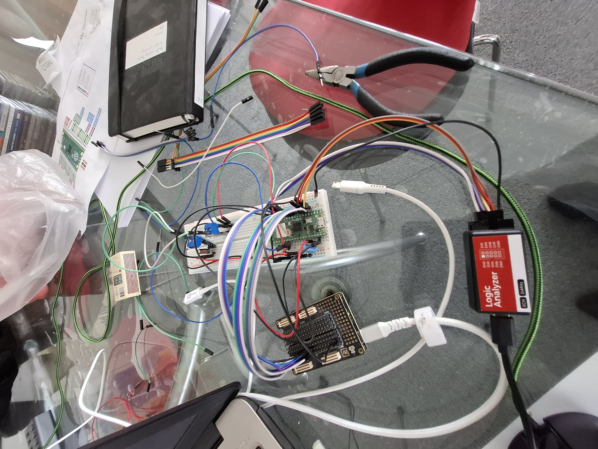

# pico_to_fpga_8bit_parallel
This is a HIGH speed parrallel interface between at pico using pio and a ice408hx fpga alchitry cu with a br board
# Pico to FPGA 8-bit Parallel PIO Interface

High-speed 8-bit parallel interface between a Raspberry Pi Pico / Pico 2 and an FPGA.

This project demonstrates how to use the Raspberry Pi Pico PIO hardware as a fast bidirectional parallel bus master. The FPGA used in the shown setup is an iCE40 HX8K based Alchitry Cu style board with a BR board/breakout setup.

The interface is intended as a practical toolbox building block. It can be extended into wider 8, 16, 32, or 64-bit FPGA interfaces, used as the base for a simple logic analyzer, or adapted for high-speed peripherals such as DACs and ADCs.

Examples of possible extensions:

- Turn an Alchitry Cu / iCE40 board into a parallel logic analyzer
- Write high-speed sample data to a DAC such as AD9767
- Read samples from a high-speed ADC
- Expand the interface width from 8-bit to 16/32/64-bit
- Use the FPGA BRAM as a fast buffer between Pico and external logic

In the shown hardware setup the practical maximum interface rate is around **12 MHz**.

---

## Hardware setup



Logic analyzer capture of the bus activity:


---

## Project overview

The repository contains both the Pico/Arduino side and the FPGA/Verilog side.

### Main source files

| File | Purpose |
|---|---|
| `picofpgav2.ino` | Arduino sketch for the Pico. Configures and controls the PIO state machines, switches the bus direction, writes test packets, reads them back, and prints status. |
| `bus_protocol.pio` | PIO assembly source for the TX and RX state machines. |
| `bus_protocol.pio.h` | Auto-generated PIO header produced by `pioasm`. Included by the Arduino sketch. |
| `8bitparalle.v` | FPGA-side 8-bit bidirectional parallel bus interface with BRAM-style buffer logic. |
| `main.v` | Top-level FPGA module. Connects the parallel interface to board pins and LEDs. |
| `pins.pcf` | FPGA pin constraints for the iCE40 / Alchitry-style board. |
| `pins.sdc` | FPGA timing constraints. |
| `asmpio.sh` | Helper script to assemble `bus_protocol.pio` into `bus_protocol.pio.h`. |
| `comp.sh` | FPGA build/program script using OSS CAD Suite. Includes seed sweep and flashing. |
| `comp.md` | Older/simple FPGA build script notes. |

---

## Bus signals

The Pico acts as the bus master.

| Signal | Pico GPIO | Direction | Description |
|---|---:|---|---|
| `D0-D7` | GP2-GP9 | Bidirectional | 8-bit parallel data bus |
| `CLK` | GP10 | Pico → FPGA | Clock / strobe / request |
| `WR/RD` | GP11 | Pico → FPGA | Bus direction control |
| `EMPTY` | GP12 | FPGA → Pico | High means no data available for read |
| `FULL` | GP13 | FPGA → Pico | High means FPGA cannot accept more write data |

---

## Bus direction rule

The most important rule in this design is that only one side may drive the data bus at a time.

```text
WR/RD = 0:
    Pico writes
    Pico GP2-GP9 = output
    FPGA data bus = input

WR/RD = 1:
    Pico reads
    Pico GP2-GP9 = input all the time
    FPGA data bus = output
```

When switching from write to read, the Pico releases the data bus before raising `WR/RD`.

When switching from read to write, the Pico lowers `WR/RD` before taking ownership of the data bus again.

---

## PIO programs

The Pico uses two PIO state machines:

- TX state machine for Pico → FPGA writes
- RX state machine for FPGA → Pico reads

Final tested PIO timing:

```pio
.program bus_master_tx
; Pico master writes to FPGA
;
; GP2-GP9  = data bus
; GP10     = clock/strobe
; GP13     = FULL from FPGA, HIGH = stop

.wrap_target
    wait 0 gpio 13
    pull block
    out pins, 8 [1]
    set pins, 1 [3]
    set pins, 0 [3]
.wrap


.program bus_master_rx
; Pico master reads from FPGA
;
; GP2-GP9  = data bus
; GP10     = clock/request/ack
; GP12     = EMPTY from FPGA, HIGH = no data

.wrap_target
    wait 0 gpio 12
    set pins, 1 [3]
    set pins, 0 [3]
    in pins, 8 [1]
    push block
.wrap
```

At a 150 MHz Pico PIO clock and `clkdiv = 1.0f`, both TX and RX take 12 PIO cycles per byte:

```text
150 MHz / 12 = 12.5 MHz
```

So the tested interface rate is approximately:

```text
TX: ~12.5 MB/s
RX: ~12.5 MB/s
```

Actual reliable speed depends on wiring, FPGA timing, logic analyzer loading, board layout, and the selected FPGA implementation.

---

## Pico / Arduino side

The Pico code is written as an Arduino `.ino` sketch and uses the Earle Philhower RP2040/RP2350 Arduino core.

The sketch uses:

```cpp
#include <Arduino.h>
#include "hardware/pio.h"
#include "hardware/gpio.h"
#include "bus_protocol.pio.h"
```

The `Bushandling` class controls:

- PIO program loading
- TX and RX state machine setup
- GPIO direction switching
- `WR/RD` mode switching
- FIFO handling
- Blocking byte write/read helpers
- Basic debug output

The Pico test code uses the RP2040/RP2350 dual-core Arduino model:

```text
Core 0:
    Serial status printing

Core 1:
    High-speed PIO bus loop
```

This keeps `Serial.print()` from slowing down the bus.

---

## FPGA side

The FPGA side consists mainly of:

- `main.v`
- `8bitparalle.v`

The FPGA interface stores incoming Pico write data in a small memory buffer and drives the bus during Pico read mode.

Important FPGA behavior:

```text
When WR/RD = 0:
    FPGA receives data from Pico
    Data is written into memory

When WR/RD = 1:
    FPGA drives the data bus
    Pico reads data using GP10 clock/request pulses
```

The FPGA exposes:

- `full_signal` to stop Pico writes when the buffer is full
- `empty_signal` to stop Pico reads when no data is available

---

## Current known test result

The test interface was run with:

```text
Pico PIO clkdiv = 1.0f
TX PIO = 12 cycles/byte
RX PIO = 12 cycles/byte
Approximate bus frequency = 12.5 MHz
```

Observed result:

```text
Normal write/read loop works.
One startup/sync error may occur during initial startup.
After startup the interface runs stable.
Serial printing was the main bottleneck before moving the bus loop to core1.
```

The startup issue is considered a synchronization/reset issue, not a steady-state bus timing issue.

A practical production version should add one of the following:

- FPGA/Pico reset handshake
- startup warmup packets
- discard first N packets after boot
- explicit packet framing or sync byte

---

## Building the Pico side

The Pico side is built in the Arduino IDE using the Earle Philhower RP2040/RP2350 core.

Recommended Arduino board package:

- <https://github.com/earlephilhower/arduino-pico>

The PIO source must be assembled into a C header before compiling the Arduino sketch.

Example helper script:

```sh
./asmpio.sh
```

The generated file is:

```text
bus_protocol.pio.h
```

This file is included by:

```text
picofpgav2.ino
```

---

## Building the FPGA side

The FPGA build uses the open source iCE40 toolchain from OSS CAD Suite.

Download OSS CAD Suite here:

- <https://github.com/YosysHQ/oss-cad-suite-build/releases>

The build flow uses:

| Tool | Purpose |
|---|---|
| `yosys` | Verilog synthesis |
| `nextpnr-ice40` | Place and route |
| `icepack` | Pack bitstream |
| `iceprog` | Program FPGA flash |
| `icetime` | Timing analysis |

The repository includes `comp.sh`, which performs synthesis, place-and-route, seed sweep, bitstream packing, and programming.

Run:

```sh
./comp.sh
```

The script expects OSS CAD Suite to be installed in:

```text
~/Dokumenter/oss-cad-suite/bin
```

Adjust the path in `comp.sh` if your installation is elsewhere.

---

## Notes about `.md` and `.sh` files

### `README.md`

Main project documentation.

### `comp.md`

This file contains an older/simple shell script example for building and programming the FPGA. Despite the `.md` extension, the content is shell-script style notes.

It is useful as a minimal reference for the FPGA build flow.

### `asmpio.sh`

Assembles the Pico PIO source:

```text
bus_protocol.pio
```

into the generated C/C++ header:

```text
bus_protocol.pio.h
```

This must match the file included by the Arduino sketch.

### `comp.sh`

Main FPGA build script.

It performs:

1. Verilog synthesis with Yosys
2. Place-and-route with nextpnr-ice40
3. Seed sweep to search for a better timing result
4. Packing with icepack
5. Flash programming with iceprog
6. Cleanup of temporary `.asc` files

This script is specific to the iCE40 HX8K CB132 target used in this setup.

---

## License

Use this project however you like.

There are no usage restrictions. You may copy it, modify it, extend it, use it in private projects, commercial projects, experiments, tools, or learning material.

The software, HDL, scripts, and documentation are provided **as-is**, with no warranty and no guarantee of fitness for any purpose.

In short:

```text
Use it as you like.
No limits.
No warranty.
```

---

## Project goal

This repository is not meant to be a polished IP core. It is a practical working reference for building fast Pico PIO to FPGA interfaces.

It is intended as a toolbox project: small, understandable, easy to modify, and useful as a starting point for bigger FPGA/Pico experiments.
